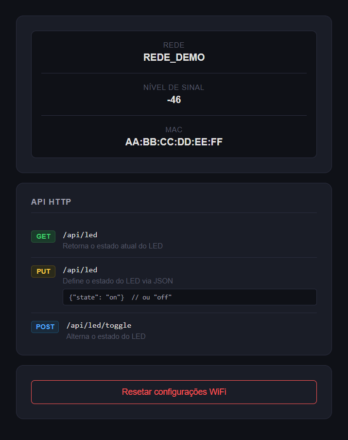

# ESP32 WEBSERVER

Transforma o ESP32 em uma API HTTP, com suporte a RESET, configurações remotas e endpoints HTTP pré implementados.

### 1. Primeira Inicialização ou após ser resetado
1. O ESP32 inicia por padrão em modo AP com ESSID definido para: `ESP32-Config`disponibilizando uma página web simples com o objetivo de configurar a conexão com uma rede sem fio existente.
2. Conectar a rede e acessar no navegador o endereço: `http://192.168.4.1`
3. Preencha o SSID e senha da rede WiFi, o ESP tentará conectar e salvará as credenciais se bem sucedido.

### 3. Resetando as configurações

**Opção A - Via Web:**
- Acessar a página principal e clicar no botão **Resetar configurações**

**Opção B - Via Botão Físico (GPIO0/BOOT):**
- Pressione e segure o botão **BOOT** no ESP32 por **3 segundos** e aguardar até o ESP reiniciar em modo AP.
